[//]: # (
http://www.w3schools.com/css/css_font.asp
http://www.cssfontstack.com/Helvetica
)

<style>  <!-- put CSS here to test quickly -->
</style>

<script type="text/x-mathjax-config">  <!-- LaTeX formula config -->
MathJax.Hub.Config({
  jax: ["input/TeX", "output/HTML-CSS"],
  "HTML-CSS": { 
      preferredFont: "Arial", 
      availableFonts: [],
      scale: 85
      // styles: {".MathJax": {color: "#CCCCCC"}} 
      }
});
</script>


```{r setup, include=FALSE}
#knitr::opts_chunk$set(echo = TRUE, eval = FALSE)
knitr::opts_chunk$set(echo = FALSE, eval = TRUE)
```

## Problem Statement

Attrition: 

* problem that impacts all businesses 
* leads to significant costs for a business
* including the cost of business disruption, hiring new staff and training new staff. 

<br>

* underderstanding the drivers is crucial
* classification models to predict if an employee is likely to quit could greatly increase HR’s ability to intervene on time and remedy the situation to prevent attrition.

## Dataset

* $n = 1470$ employees and some of their attributes (selection below):

| Name | Description |
|------|-------------|
|AGE| Numerical Value |
|GENDER|(1=FEMALE, 2=MALE)|
|EDUCATION|Numerical Value|
|BUSINESS TRAVEL|(1=No Travel, 2=Travel Frequently, 3=Tavel Rarely)|
|DISTANCE FROM HOME|Numerical Value - THE DISTANCE FROM WORK TO HOME|
|JOB SATISFACTION|Numerical Value - SATISFACTION WITH THE JOB|
|MONTHLY INCOME|Numerical Value - MONTHLY SALARY|
|NUMCOMPANIES WORKED|Numerical Value - NO. OF COMPANIES WORKED AT|
|OVERTIME|(1=NO, 2=YES)|
|PERCENT SALARY HIKE|Numerical Value - PERCENTAGE INCREASE IN SALARY|
|PERFORMANCE RATING|Numerical Value - ERFORMANCE RATING|
|TOTAL WORKING YEARS|Numerical Value - TOTAL YEARS WORKED|
|TRAINING TIMES LAST YEAR|Numerical Value - HOURS SPENT TRAINING|
|WORK LIFE BALANCE|Numerical Value - TIME SPENT BEWTWEEN WORK AND OUTSIDE|
|YEARS AT COMPANY|Numerical Value - TOTAL NUMBER OF YEARS AT THE COMPNAY|
|YEARS SINCE LAST PROMOTION|Numerical Value - LAST PROMOTION|
|ATTRITION|Employee leaving the company (0=no, 1=yes) |

* Target variable `Attrition`: Whether or not an employee has quit
    
## Data Exploration 

<div></div><!-- ------------------------------- needed as is before cols - -->
<div style="float: left; width: 48%;"><!-- ---- start of first column ---- -->

* Target variable `Attrition` imbalanced
* No missing values in the data
* Some features with no variation: 
    * `EmployeeCount`: constant, always 1
    * `Over18`: constant, always Y
    * `StandardHours`: constant at 80

</div><!-- ------------------------------------ end of first column ------ -->
<div style="float: left; width: 4%"><br></div><!-- spacing column -------- -->
<div style="float: left; width: 48%;"><!-- ---- start of second column --- --> 

```{r, eval = TRUE, echo = FALSE, out.width = "100%", fig.align = "left"}
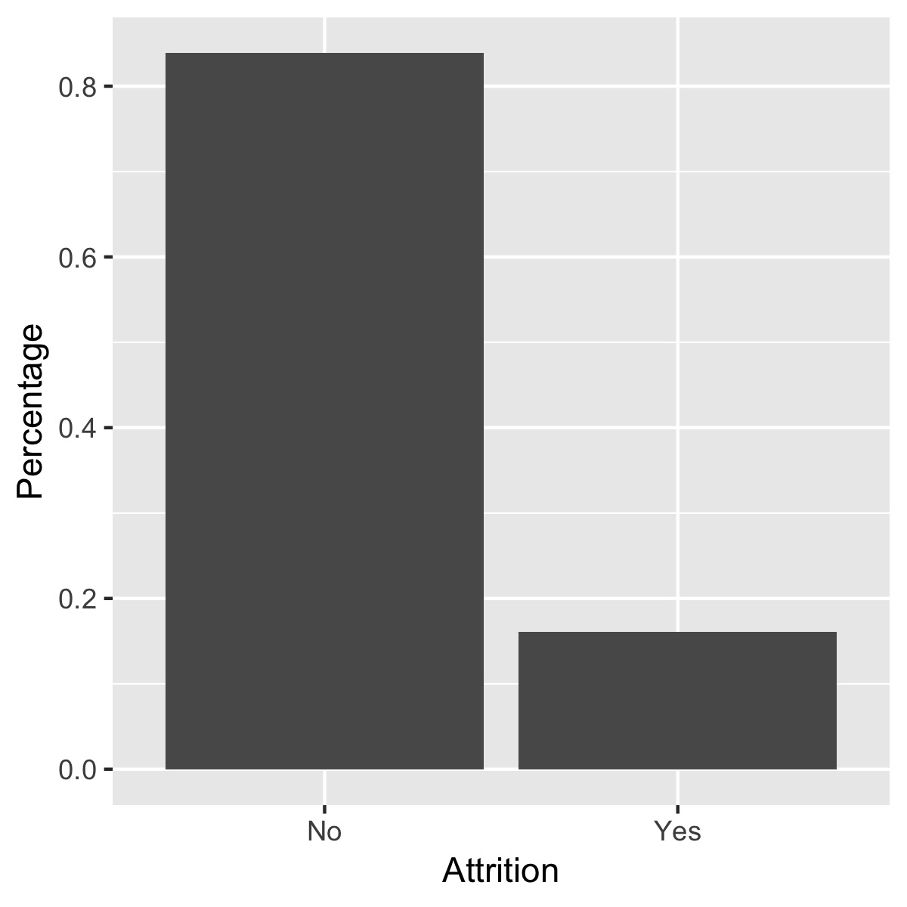
```

</div><!-- ------------------------------------ end of second column ----- -->
<div style="clear: both"></div><!-- end cols for text over both cols below -->


## Data Exploration


<div></div><!-- ------------------------------- needed as is before cols - -->
<div style="float: left; width: 38%;"><!-- ---- start of first column ---- -->

* Feature correlations:
```r
cormat_long %>% 
  filter(Var1 != Var2, abs(value) > .8) %>% 
  arrange(value)
```
```
           Var1              Var2      value
1 MaritalStatus  StockOptionLevel -0.8131347
2    Department           JobRole  0.8508444
3      JobLevel TotalWorkingYears  0.8523883
4      JobLevel     MonthlyIncome  0.9675631
```

Pearson correlations,  
polyserial correlations, and  
polychoric correlations

</div><!-- ------------------------------------ end of first column ------ -->
<div style="float: left; width: 4%"><br></div><!-- spacing column -------- -->
<div style="float: left; width: 58%;"><!-- ---- start of second column --- --> 

```{r, eval = TRUE, echo = FALSE, out.width = "100%", fig.align = "left"}
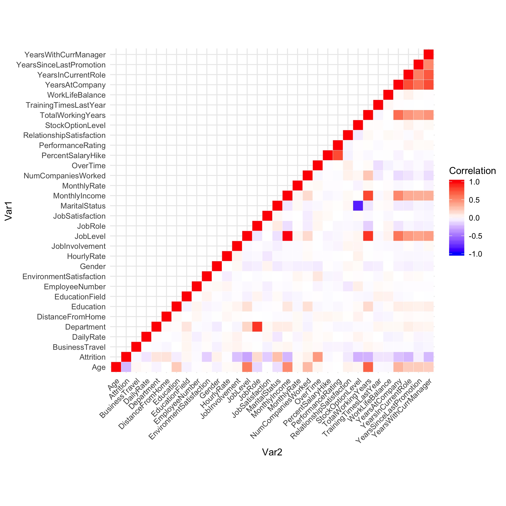
```

</div><!-- ------------------------------------ end of second column ----- -->
<div style="clear: both"></div><!-- end cols for text over both cols below -->


## Features used in the model

* Features used in the model:

```r
varnames_features
```
```
 [1] "Age"                      "BusinessTravel"           "DailyRate"               
 [4] "DistanceFromHome"         "Education"                "EducationField"          
 [7] "EnvironmentSatisfaction"  "Gender"                   "HourlyRate"              
[10] "JobInvolvement"           "JobRole"                  "JobSatisfaction"         
[13] "MaritalStatus"            "MonthlyIncome"            "MonthlyRate"             
[16] "NumCompaniesWorked"       "OverTime"                 "PercentSalaryHike"       
[19] "PerformanceRating"        "RelationshipSatisfaction" "StockOptionLevel"        
[22] "TotalWorkingYears"        "TrainingTimesLastYear"    "WorkLifeBalance"         
[25] "YearsAtCompany"           "YearsInCurrentRole"       "YearsSinceLastPromotion" 
[28] "YearsWithCurrManager"    
```

* Features excluded:
    * features with no relevant information: `EmployeeNumber`
    * constant features: `EmployeeCount`, `Over18`, `StandardHours`
    * highly correlated features: `JobLevel`, `Department`

## Categorical variables

* Variable description did not provide scale level
* hence, some features were assumed to be categorical and dummy-coded:

```r
varnames_convert_to_cat
```
```
[1] "WorkLifeBalance"          "StockOptionLevel"         "RelationshipSatisfaction"
[4] "JobSatisfaction"          "JobLevel"                 "JobInvolvement"          
[7] "EnvironmentSatisfaction"  "Education" 
```

* all of them are in a range of `[1, 4]` or `[1, 5]`
* No information about how the information was collected
* Might be a Likert-Scale (ordinal or even interval scale)
* But might also be totally unrelated options (nominal scale)
* Assumed to be ordinal scale, just to be on the save side


## Assumptions: Summary

* Data on individual level and not aggregated  
  (even though there is a variable `EmployeeCount`)
* Some variables were assumed to be nominal scale,  
  even though this might not be the case

* [[?]] some assumption about monthlyrate and monthlyincome and their non-relation?


## Train-/Eval-/Test-Split

<div></div><!-- ------------------------------- needed as is before cols - -->
<div style="float: left; width: 48%;"><!-- ---- start of first column ---- -->

* Data was split into 3 parts using random sampling:
    * Training set: $80\%$, $n = 1180$
    * Evaluation set: $10\%$, $n = 135$
    * Test set: $10\%$, $n = 155$

* Distribution of target variable in each part remained essentially unchanged:

</div><!-- ------------------------------------ end of first column ------ -->
<div style="float: left; width: 4%"><br></div><!-- spacing column -------- -->
<div style="float: left; width: 48%;"><!-- ---- start of second column --- --> 

```{r, eval = TRUE, echo = FALSE, out.width = "100%", fig.align = "left"}
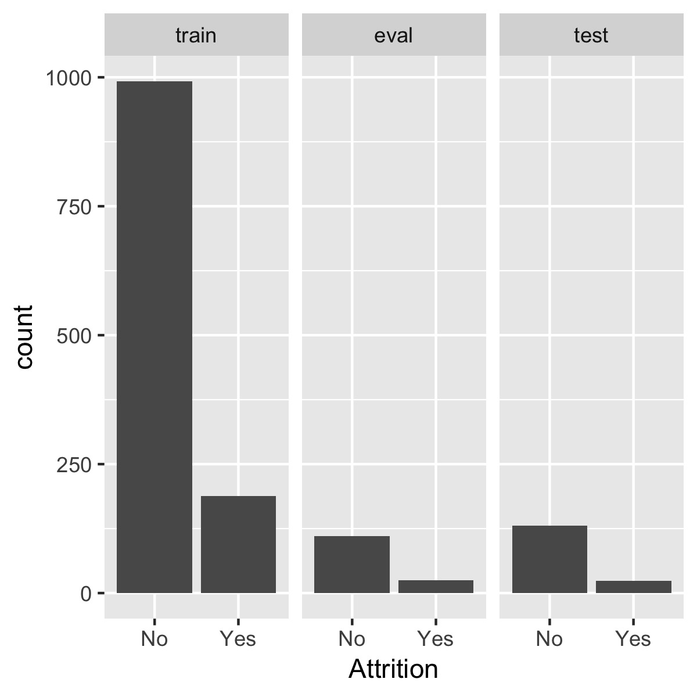
```

</div><!-- ------------------------------------ end of second column ----- -->
<div style="clear: both"></div><!-- end cols for text over both cols below -->


## Upsampling the Training Set

<div></div><!-- ------------------------------- needed as is before cols - -->
<div style="float: left; width: 48%;"><!-- ---- start of first column ---- -->

* To balance out the classes, SMOTE sampling was used for the training set
    * Synthetic Minority Oversampling Technique
    * Undersamples the majority class
    * Creates synthetic examples of the minority class
    * by randomly varying the features of $k$ nearest neighbours ($k = 5$ in this case)
* Validation and test set remain untouched

```r
set.seed(9560)
formula_smote <- paste0(varnames_target, " ~ .") %>% 
  as.formula()
dat_model <- SMOTE(formula_smote,   ##  Attrition ~ .
                   data  = dat_model_imbal %>% as.data.frame())    
```

</div><!-- ------------------------------------ end of first column ------ -->
<div style="float: left; width: 4%"><br></div><!-- spacing column -------- -->
<div style="float: left; width: 48%;"><!-- ---- start of second column --- --> 

```{r, eval = TRUE, echo = FALSE, out.width = "100%", fig.align = "left"}
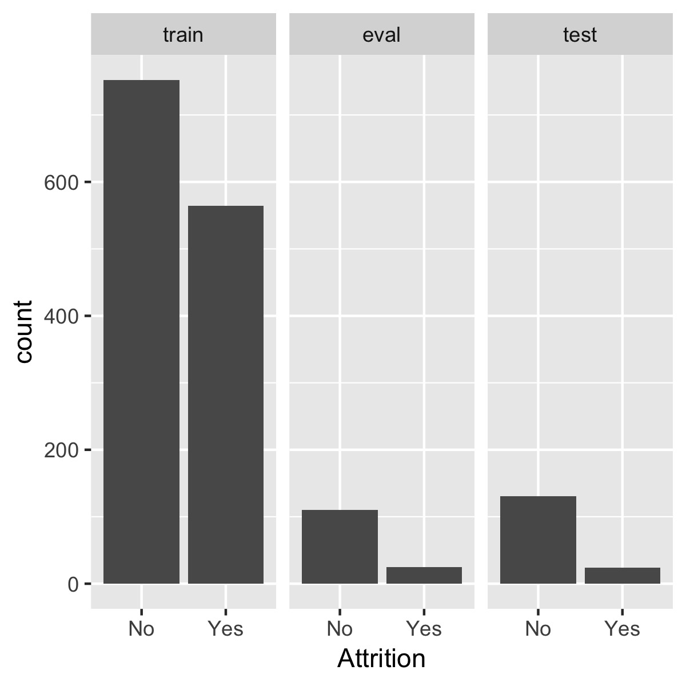
```

</div><!-- ------------------------------------ end of second column ----- -->
<div style="clear: both"></div><!-- end cols for text over both cols below -->


## Machine Learning Models

* A number of models were fitted to the training data:
    * Logistic regression (R's `base` package)
    * Elastic net regression (`glmnet` package) 
    * Random forest (`ranger` package)
    * Boosted GLMs (`glmboost` from the model-based boosting package `mboost`)
    * XGBoost (`xgboost` package)
    * AdaBoost (`adaboost` package) 
    * Neural net with 1 hidden layer (`nnet` package)
    

## Model Fitting

* **Data preparation**: nominal variables were manually dummy-coded for model tuning and (initial) model fitting (necessary for applying XGBoost, unfortunately)
* All model tuning and fitting was performed using the `mlr` package

* **Parameter tuning**: 50 iterations of random search with 6-fold CV within the training set
* **Performance measure**: Matthew's Correlation Coefficient (MCC) 
    * basically is the correlation of true and predicted labels
    * suitable for imbalanced samples

```r
## set random seed, also valid for parallel execution:
set.seed(4271, "L'Ecuyer")

## choose resampling strategy for parameter tuning:
rdesc <- makeResampleDesc(predict = "both", 
                          method = "CV", iters = 6)

## parameters for parameter tuning:
n_maxit <- 50
ctrl <- makeTuneControlRandom(maxit = n_maxit)  
tune_measures <- list(mcc, auc, f1, bac, acc, mmce, timetrain, timepredict)
```


## Model Fitting and Evaluation

* For **evaluation of performance stability** 
    * Models were fitted with 3x repeated 5-fold cross-validation
    * Within the training set
    * Using tuned parameters
* For **evaluation of model performance** 
    * Models were re-fitted on the complete training set
    * And performance was evaluated on the evaluation set
* Subset of models was re-fitted on complete training set
    * using non-dummy-coded data
    * for easier model interpretation
* Final **evaluation of performance on the test set**


# Results

## Model Performance Stability

<div></div><!-- ------------------------------- needed as is before cols - -->
<div style="float: left; width: 48%;"><!-- ---- start of first column ---- -->

* Performance spread similar for most models
* Higher spread for neural network
* Performance can't be judged within the training set because of SMOTE-sampling
* Severe overfitting for some models (ranger, XGBoost, AdaBoost, neural net)

```r
bmr_train_summary %>% select(matches("learner|mcc"))
```
```
        learner.id mcc_train.train.mean mcc.test.mean
1   classif.logreg            0.6108784     0.5515077
2   classif.glmnet            0.5985743     0.5406190
3   classif.ranger            0.9632905     0.7085456
4 classif.glmboost            0.6033816     0.5381702
5  classif.xgboost            1.0000000     0.7962943
6      classif.ada            0.9814215     0.7535416
7     classif.nnet            0.8474984     0.5990635
```

</div><!-- ------------------------------------ end of first column ------ -->
<div style="float: left; width: 4%"><br></div><!-- spacing column -------- -->
<div style="float: left; width: 48%;"><!-- ---- start of second column --- --> 

```{r, eval = TRUE, echo = FALSE, out.width = "100%", fig.align = "left"}
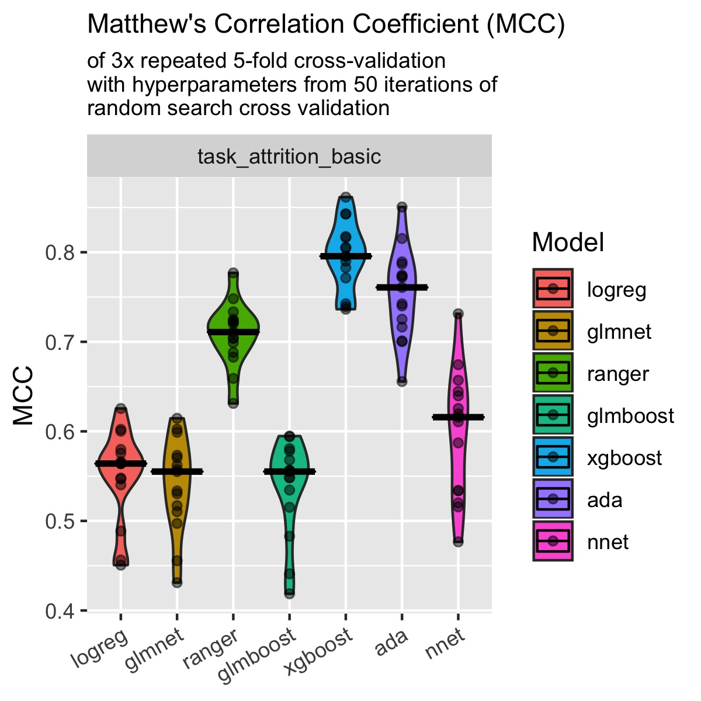
```

</div><!-- ------------------------------------ end of second column ----- -->
<div style="clear: both"></div><!-- end cols for text over both cols below -->


## Performance in Evaluation Set


<div></div><!-- ------------------------------- needed as is before cols - -->
<div style="float: left; width: 48%;"><!-- ---- start of first column ---- -->

* Boosted GLMs have highest performance in test set (MCC)
* Followed by elastic net regression and logistic regression
* XGBoost, AdaBoost and ranger: worse performance

* Other performance measures: glmboost one of the top contenders

```r
bmr_traineval_summary_rnd
```
```
        learner.id mcc.test auc.test bac.test acc.test
1   classif.logreg    0.560    0.870    0.726    0.881
2   classif.glmnet    0.593    0.873    0.700    0.889
3   classif.ranger    0.446    0.801    0.635    0.859
4 classif.glmboost    0.625    0.872    0.720    0.896
5  classif.xgboost    0.542    0.785    0.737    0.874
6      classif.ada    0.465    0.847    0.708    0.852
7     classif.nnet    0.443    0.813    0.715    0.837
```

</div><!-- ------------------------------------ end of first column ------ -->
<div style="float: left; width: 4%"><br></div><!-- spacing column -------- -->
<div style="float: left; width: 48%;"><!-- ---- start of second column --- --> 

```{r, eval = TRUE, echo = FALSE, out.width = "100%", fig.align = "left"}
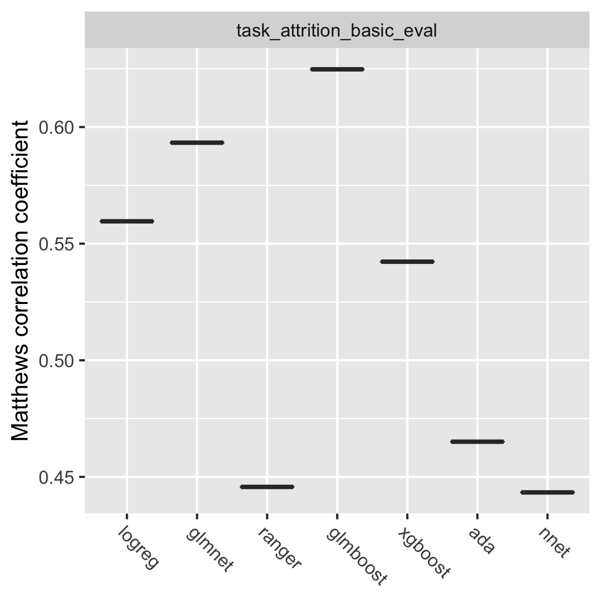
```

</div><!-- ------------------------------------ end of second column ----- -->
<div style="clear: both"></div><!-- end cols for text over both cols below -->


## todo

[[todo]]: plot of non-rounded summary data for all measures 


## Performance in Test Set

[[todo]]


## Most important Features

<div></div><!-- ------------------------------- needed as is before cols - -->
<div style="float: left; width: 48%;"><!-- ---- start of first column ---- -->

Most important features:

* Working overtime
* Job role (but with low confidence)
* Total working years
* Number of companies worked for
* Years in current role
* Education field
* Work life balance

</div><!-- ------------------------------------ end of first column ------ -->
<div style="float: left; width: 4%"><br></div><!-- spacing column -------- -->
<div style="float: left; width: 48%;"><!-- ---- start of second column --- --> 

```{r, eval = TRUE, echo = FALSE, out.width = "100%", fig.align = "left"}
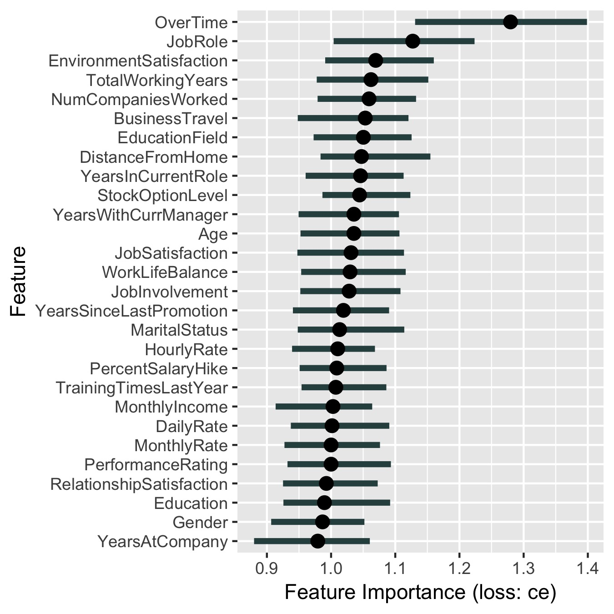
```

</div><!-- ------------------------------------ end of second column ----- -->
<div style="clear: both"></div><!-- end cols for text over both cols below -->


## Feature Effects: Overtime

<div></div><!-- ------------------------------- needed as is before cols - -->
<div style="float: left; width: 48%;"><!-- ---- start of first column ---- -->

* ICE plot: Independent Conditional Expectations
    * Predicted probability when 1 feature is varied (others untouched)
    * For all observations individually  
      (dots or thin lines)
    * And summary measure (median or mean)
    * For categorical variables: probability for each outcome  
      (Focus on right plot: Probability for `Attrition == Yes`)

* Higher probability for Attrition of you (have to?) work overtime

</div><!-- ------------------------------------ end of first column ------ -->
<div style="float: left; width: 4%"><br></div><!-- spacing column -------- -->
<div style="float: left; width: 48%;"><!-- ---- start of second column --- --> 

```{r, eval = TRUE, echo = FALSE, out.width = "100%", fig.align = "left"}
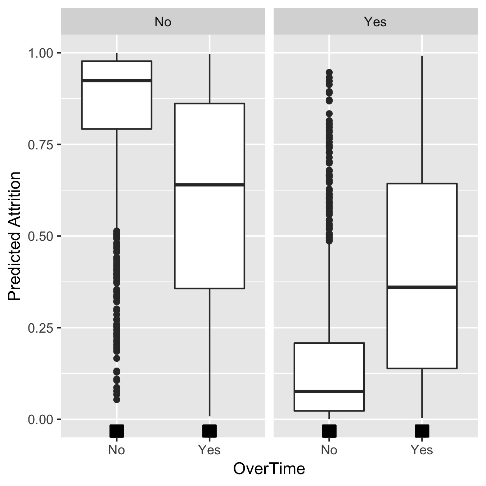
```

</div><!-- ------------------------------------ end of second column ----- -->
<div style="clear: both"></div><!-- end cols for text over both cols below -->


## Feature Effects: Job Role

```{r, eval = TRUE, echo = FALSE, out.width = "100%", fig.align = "left"}
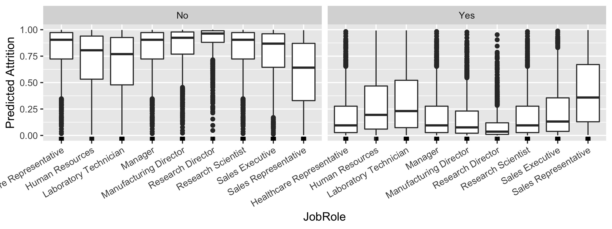
```

* Highest risk for Sales Representatives, Lab Technicians and HR


## Feature Effects: Total Working Years

<div></div><!-- ------------------------------- needed as is before cols - -->
<div style="float: left; width: 48%;"><!-- ---- start of first column ---- -->

* The more working years, the lower the probability for attrition
* Similar effect for age (correlated)

</div><!-- ------------------------------------ end of first column ------ -->
<div style="float: left; width: 4%"><br></div><!-- spacing column -------- -->
<div style="float: left; width: 48%;"><!-- ---- start of second column --- --> 

```{r, eval = TRUE, echo = FALSE, out.width = "100%", fig.align = "left"}
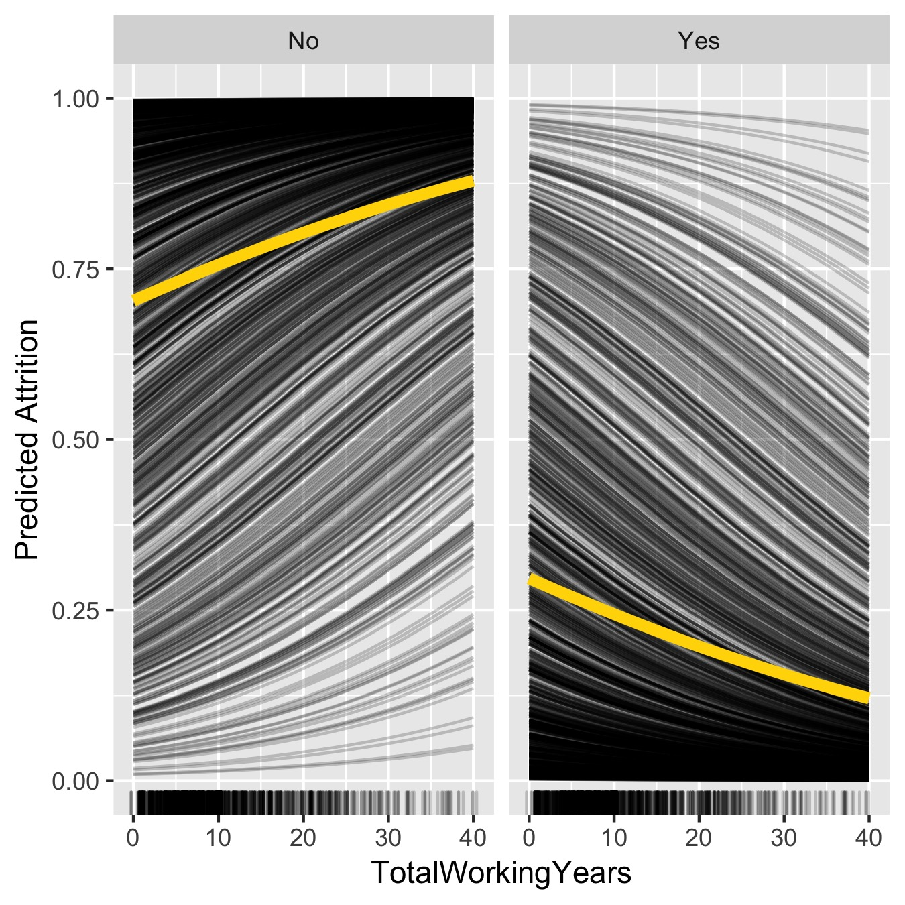
```

</div><!-- ------------------------------------ end of second column ----- -->
<div style="clear: both"></div><!-- end cols for text over both cols below -->


## Feature Effects: Number of Companies worked

<div></div><!-- ------------------------------- needed as is before cols - -->
<div style="float: left; width: 48%;"><!-- ---- start of first column ---- -->

* The more jobs someone held, the higher the probability for attrition


</div><!-- ------------------------------------ end of first column ------ -->
<div style="float: left; width: 4%"><br></div><!-- spacing column -------- -->
<div style="float: left; width: 48%;"><!-- ---- start of second column --- --> 

```{r, eval = TRUE, echo = FALSE, out.width = "100%", fig.align = "left"}
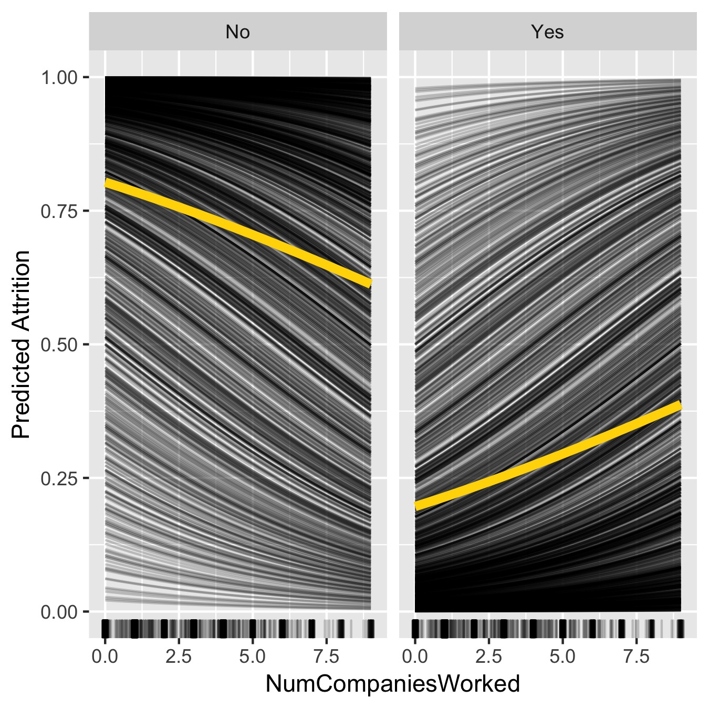
```

</div><!-- ------------------------------------ end of second column ----- -->
<div style="clear: both"></div><!-- end cols for text over both cols below -->


## Feature Effects: Work Life Balance

```{r, eval = TRUE, echo = FALSE, out.width = "100%", fig.align = "left"}
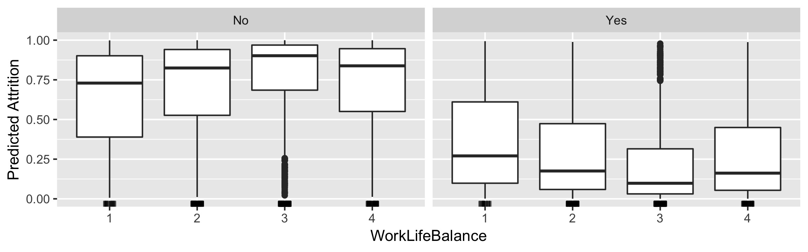
```

* Was treated as categorical variable: Lowest risk in category 3
* In case that this is assessed via a Likert scale, that might be of interest
* Assuming high values are "good work life balance", this seems to indicate that work life balance can be too good...


## Discussion

* Results were not very surprising: Working overtime, less years in jobs, more jobs held are associated with higher probability for attrition
* Work-life-balance effects somewhat interesting

* Model performance only mediocre at best
* Effects are not very strong
* Other features might be more valuable: Management style, flexible working time, amount and quality of team work, etc.
* Some potentially useful features might be ethically and legally critical (GDPR), e.g., shifts in starting time

* Apart from a better model, other things might be more valuable to understand attrition: Qualitative research, starting with sitting down with your employees and listening to them 


