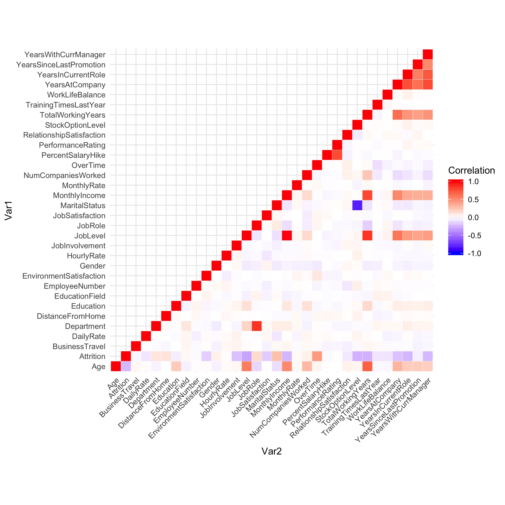

[//]: # (
http://www.w3schools.com/css/css_font.asp
http://www.cssfontstack.com/Helvetica
)

<style>  <!-- put CSS here to test quickly -->
</style>

<script type="text/x-mathjax-config">  <!-- LaTeX formula config -->
MathJax.Hub.Config({
  jax: ["input/TeX", "output/HTML-CSS"],
  "HTML-CSS": { 
      preferredFont: "Arial", 
      availableFonts: [],
      scale: 85
      // styles: {".MathJax": {color: "#CCCCCC"}} 
      }
});
</script>


## Problem Statement

Attrition: 

* problem that impacts all businesses 
* leads to significant costs for a business
* including the cost of business disruption, hiring new staff and training new staff. 

<br>

* underderstanding the drivers is crucial
* classification models to predict if an employee is likely to quit could greatly increase HR’s ability to intervene on time and remedy the situation to prevent attrition.

## Dataset

* $n = 1470$ employees and some of their attributes:

| Name | Description |
|------|-------------|
|AGE| Numerical Value |
|GENDER|(1=FEMALE, 2=MALE)|
|EDUCATION|Numerical Value|
|BUSINESS TRAVEL|(1=No Travel, 2=Travel Frequently, 3=Tavel Rarely)|
|DISTANCE FROM HOME|Numerical Value - THE DISTANCE FROM WORK TO HOME|
|JOB SATISFACTION|Numerical Value - SATISFACTION WITH THE JOB|
|MONTHLY INCOME|Numerical Value - MONTHLY SALARY|
|NUMCOMPANIES WORKED|Numerical Value - NO. OF COMPANIES WORKED AT|
|OVERTIME|(1=NO, 2=YES)|
|PERCENT SALARY HIKE|Numerical Value - PERCENTAGE INCREASE IN SALARY|
|PERFORMANCE RATING|Numerical Value - ERFORMANCE RATING|
|TOTAL WORKING YEARS|Numerical Value - TOTAL YEARS WORKED|
|TRAINING TIMES LAST YEAR|Numerical Value - HOURS SPENT TRAINING|
|WORK LIFE BALANCE|Numerical Value - TIME SPENT BEWTWEEN WORK AND OUTSIDE|
|YEARS AT COMPANY|Numerical Value - TOTAL NUMBER OF YEARS AT THE COMPNAY|
|YEARS SINCE LAST PROMOTION|Numerical Value - LAST PROMOTION|
|ATTRITION|Employee leaving the company (0=no, 1=yes) |

* Target variable `Attrition`: Whether or not an employee has quit
    
## Data Exploration 

<div></div><!-- ------------------------------- needed as is before cols - -->
<div style="float: left; width: 48%;"><!-- ---- start of first column ---- -->

* Target variable `Attrition` imbalanced
* No missing values in the data
* Some features with no variation: 
    * `EmployeeCount`: constant, always 1
    * `Over18`: constant, always Y
    * `StandardHours`: constant at 80

</div><!-- ------------------------------------ end of first column ------ -->
<div style="float: left; width: 4%"><br></div><!-- spacing column -------- -->
<div style="float: left; width: 48%;"><!-- ---- start of second column --- --> 


</div><!-- ------------------------------------ end of second column ----- -->
<div style="clear: both"></div><!-- end cols for text over both cols below -->


## Data Exploration


<div></div><!-- ------------------------------- needed as is before cols - -->
<div style="float: left; width: 38%;"><!-- ---- start of first column ---- -->

* Feature correlations:
```r
cormat_long %>% 
  filter(Var1 != Var2, abs(value) > .8) %>% 
  arrange(value)
```
```
           Var1              Var2      value
1 MaritalStatus  StockOptionLevel -0.8131347
2    Department           JobRole  0.8508444
3      JobLevel TotalWorkingYears  0.8523883
4      JobLevel     MonthlyIncome  0.9675631
```

Pearson correlations,  
polyserial correlations, and  
polychoric correlations

</div><!-- ------------------------------------ end of first column ------ -->
<div style="float: left; width: 4%"><br></div><!-- spacing column -------- -->
<div style="float: left; width: 58%;"><!-- ---- start of second column --- --> 



</div><!-- ------------------------------------ end of second column ----- -->
<div style="clear: both"></div><!-- end cols for text over both cols below -->


## Features used in the model


